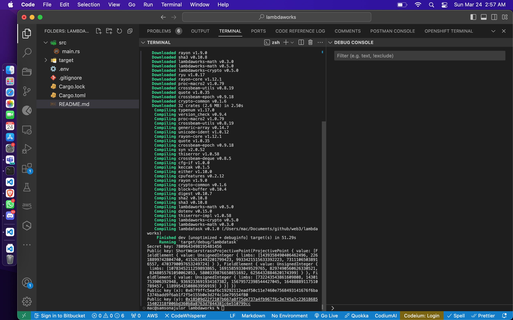

# Decryption

This program computes the public key associated with the secret key 0x6C616D6264617370 using the BLS12-381 elliptic curve.

## Usage

To run the project, execute the following command:

- create a .env file in the root of the repository.
- add a variable
`SECRET_KEY=6C616D6264617370`
- run the command below:
```bash
cargo run
```

Ensure to have installed rust and tools.

- result:
